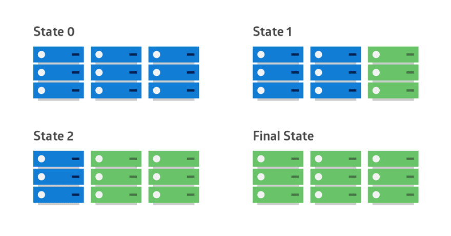

# Construcción sobre el desafió

## Se construyo toda la implementación del desafió en 5 carpetas y con :

    AWS - Como nube que provee los servicios
    Docker - Como virtualizado de aplicaciones
    ECR - Registry de docker como servicio de aws
    Kubernetes - Como orquestados de los contenedores
    Jenkins - Como herramienta de cd/cd
    Github - Como repositorio de código
    Despliegue alternativo a jenkins de bajo costo - Hecho en Código en bash
    Monitor - Con grafana, influxdb y telegraf

## Carpetas 

### local-deploy

Contiene el código de la aplicación, el Dockerfile y de docker-compose de como generar la imagen del proyecto. También contiene un script para crear las capetas necesarias, poner como configuración externa el db.json y deployar todo.

### aws

Toda la configuración que se hace en aws esta guardada y organizada en la carpeta llamada "aws", que contiene la configuración de todo el proceso y los manuales en markdown de como hacer cada cosa

### Jenkins

Contiene toda la configuración de como customizar la imagen base dockerizada de jenkins para usarla dentro de kubernetes como herramienta de cd/cd para kubernetes con ademas de los plugins necesarios.

También contiene la creación del usuario de kubernetes para jenkins, el script para obtener el usuario como un KUBECONFIG y finalmente el cronjob para poder usar la registry de aws con la regeneración de credenciales que se vencen cada 8 horas.

    yaml/role-admin.yaml
    sh/kubeconfig-generator.sh
    yaml/cron-jobs-aws-registry-devops-tools.yaml
    yaml/cron-jobs-aws-registry-dev.yaml
    yaml/user-cron-registry.yaml

Ademas, tiene los diferentes yaml para desplegar jenkins en kubernetes, crear los namespace de "dev" para los microservicios y el de "devops-tools" para contener aislado a jenkins.

    yaml/namespace.yaml
    yaml/jenkins-server.yaml

Por ultimo tiene un pipeline sencillo como librerías de jenkins en groovy y bash para simplificar y poder reutilizar el código de un pipeline.

    librerias

También esta la opción de hacer el despliegue de jenkins local con docker-compose.

    local/docker-compose.yaml

### Kubernetes deploy manual

Contiene un script de ejemplo en bash de un pipeline muy simple que : 
    - compilar la imagen
    - genera las claves de aws
    - enviá la imagen
    - hacer el deploy del configmap
    - hace el deploy del microservicio 

## Monitoring

Se construyo un monitoreo sencillo que se pudiera montar sobre un eks de aws con los ec2 de la capa gratuita de aws de 1gm de ram y 1 cpu.

La carpeta contiene :

    - La construcción de los volúmenes para guardar datos.
    - El despliegue y configuración de grafana (dashboard)
    - El despliegue y configuración de influxdb (base de datos)
    - El despliegue y configuración de telegraf (agente de recolección)

## Tipo de deploy utilizado para este ejercicio

Existen varios tipos de deploy que se utilizan actualmente que se pueden resumir de la siguiente manera :

    Bigbang -- destruye y luego aplica
    Rolling -- Saca de a unos los equipo y los va actualizando
    Canry -- Tiene 2 infraestructuras y para probar la nueva le va enviando un poco de trafico mientras deja el resto en el equipo viejo
    Blue-Green -- Se tiene dos infraestructuras y se apaga una y se prende otra.

### Opción Elegida para este reto :

-- Desarrollo

Se decidió tomar como premisa hacer un pipeline para el ambiente de desarrollo tanto con la opción de jenkins como con la de bash.

Tomando como premisa que al ambiente que se iba a crear es desarrollo y que este es un ambiente de pruebas inestable y no de cara a un usuario final, se uso la opción de despliegue por BigBang.

    La opción de despliegue utilizada toma como concepto que no tiene sentido duplicar infraestructura ni tiempos ni costos en hacer un proceso mas complicado para un despliegue en un ambiente volátil como es desarrollo, ademas que cuanto mas limpio este el ambiente mas precisas van a ser las pruebas hechas en el mismo.

-- Producción

Para ambientes productivos no hay una decision definitiva para tomar en que tipo de deploy voy a utilizar, este depende mucho de las necesidades de dueño de la plataforma, que tipo de servicio brindo y que tipo de disponibilidad tengo sobre el servicio.

Por ejemplo :

*** Blue-Green

    Para el mundo bancario/transacción cuando se van a aplicar cambios sobre sistemas que no puede convivir un espado viejo y uno nuevo, la mejor opción es un diploy tipo Blue-Green:

*** Rolling

    Para el caso donde solo se apliquen actualización de sistema operativo o parches de seguridad, la mejor opción el Rollling, ya que no tengo que hacer grandes gastos de infraestructura y los cambios que introduzca no me van a cambiar la operatoria del sistema.

*** Canary

    Para el caso como por ejemplo de netflix, donde lo que es primordial es mantener el alto trafico de usuario y la disponibilidad del sistema, suele aplicar una metodologia mas estilo canary. Donde tiene dos infraestructura paralelas y solo una porción de sus usuario son dirigidos a la nueva plataforma para ir viendo como responden.

 