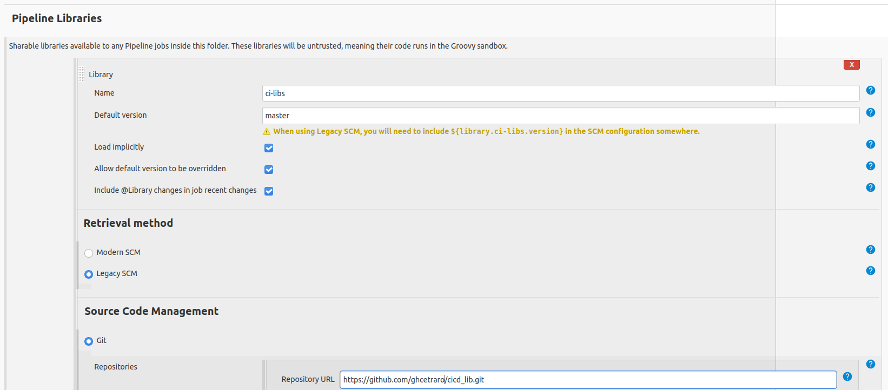
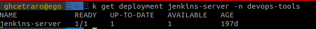
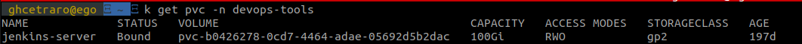
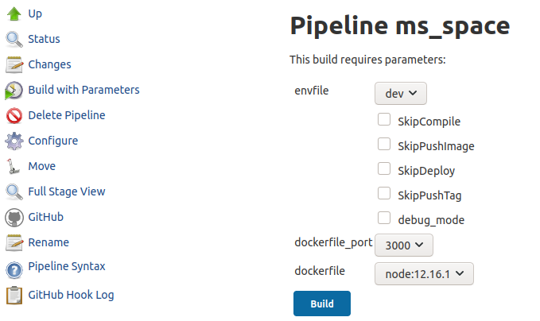
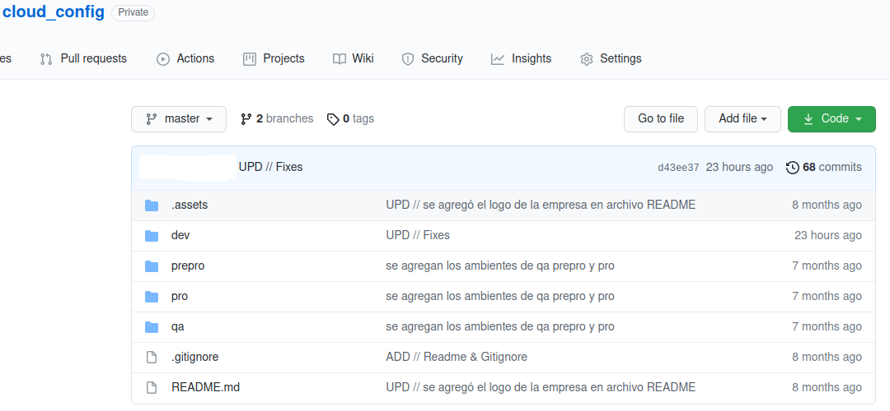

# Deploy con Jenkins

El presente ejemplo de repositorio tiene varias partes, a tener en cuenta :

## Librerias de jenkins

    Las librerias compartidas de jenkins, con un ejemplo de Pipeline para kuberntes en aws. Este es un repositorio que se tiene que crear en github que utilizar jenkins cada vez que corre un job. El fin de este es no poder todo el codigo del "Pipeline" en cada repo que se intenta deployar en jenkins.

La construccion de jenkins con su deploy como "stand alone" en kubernetes con su volumen persistente y sus plugins.

    Jenkins en Kubernetes

    Volumen de jenkins en kubernetes

    El job de jenkins dinamico

    
    La configuracion de un Pipeline que trate las configuraciones dinamicamente desde otro repositor git, que funcione de cloud config.

