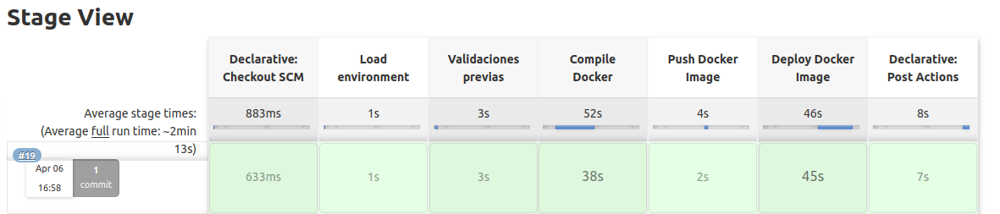

# Pipeline

El ejemplo de pipeline en el presente repositor tiene las siguientes caracteristicas :

    - Clona el codigo de un repositorio remoto en github del branch develop
    - Verifica que se cumplan las dependencia, como archivos de configuracion en el repositor Cloud-Config
    - Compila la imagen de docker
    - La envia a la registry de aws
    - Deploya la imagen en kubernetes
    - Genera un Tag en github con el mismo ide de la imagen

