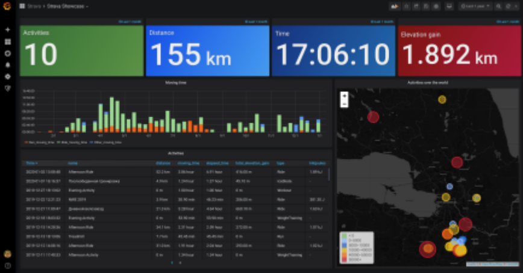
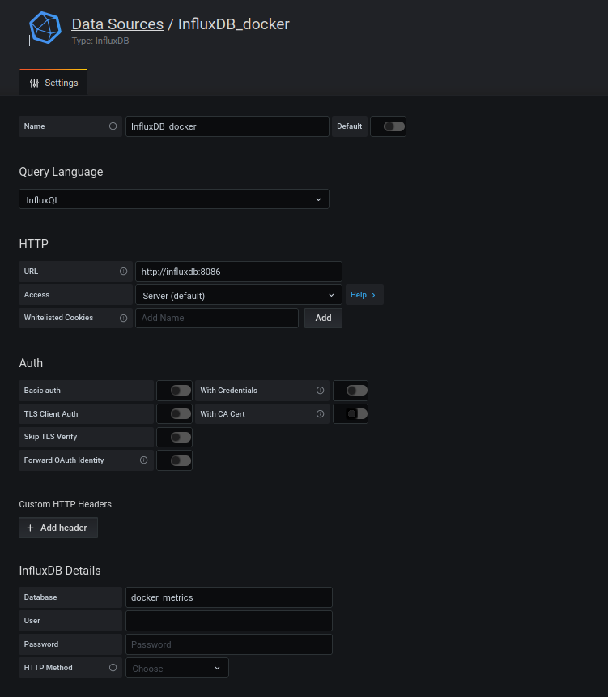
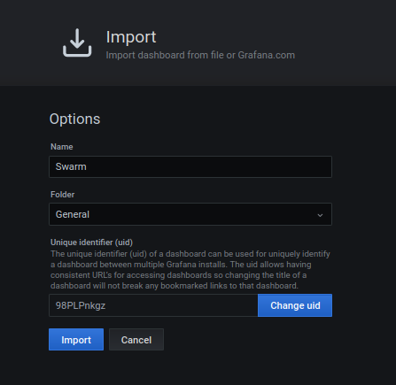
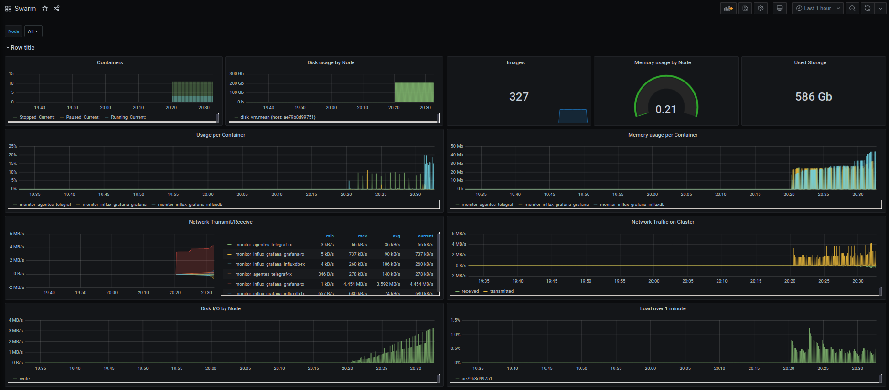

# Monitoreo

## Características 

El presente sistema de monitoreo esta basado en tecnologías opensource que se deployan sobre kubernetes o sobre docker-swarm. 

Este esta compuesto por 3 componentes :

*** grafana -- Dashboard

*** influxdb -- Basa de datos

*** telegraf -- Agente de recolección

### Especial Kubernetes

Ademas para que estos componentes puedan funcionar correctamente en kubernetes se configuro :

    - Volúmenes persistentes (pvc) para guardar los datos
    - Su propio namespace
    - Su servicio y publicación directa por el load balancer de eks.

Por ultimo, dentro de la carpeta de kuberntes/grafana en el despliegue se adjunta el ".json" que tiene un ejemplo de dashboard básico para poner en grafana.

### Docker-swarm

Para desplegar en local solo hay que correr el script que dice "Deploy.sh", que activa docker swarm, genera las carpetas necesarias y despliega todos los componentes. Solo hay que cargar el dashboard de ejemplo una vez que se active grafana.

Grafana accesos:

    http://localhost:3000
    user: admin
    password: admin

### Configuración de Grafana docker-swarm

Una vez que grafana se inicie hay que cargar el "data source" y el "dashboard". 

Hay que crear 2 data sources, 

    Nombre : "InfluxDB_vms" -- Apunta a database "vm_metrics" 
    Nombre : "InfluxDB_docker" -- Apunta a database "docker_metrics"

con usuario y password en blanco apuntando a  http://influxdb:8086

luego hay que importar el dashboard :

Finalmente el dashboard para docker swarm se vera :

